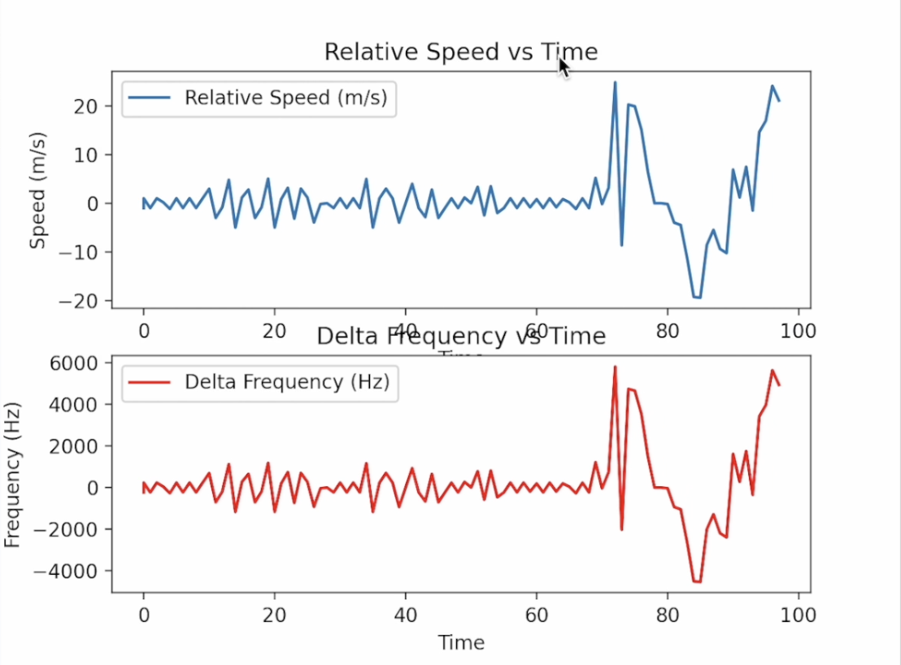

# 프로젝트 도플러
본 프로젝트는 2024학년도 고등학교 3학년 1학기 물리학II에서 도플러 효과를 실험하는 장치의 코드입니다.\
이 코드의 목적은 물체의 상대속도와 도플러 효과로 인한 주파수 변화 측정과 그래프 변환입니다. \
사용 전 코드에 하드코딩 된 값을 확인하시고, 물리학 비 전공자가 작성한 코드이므로\
본 코드를 사용하시기 전 정확하게 계산 수식이 작성되었는지 면밀하게 검토하신 후 사용하시길 바랍니다.

본 코드에 하드웨어와 직접적으로 연관되어있으나, 하드코딩 된 값은 다음과 같습니다.

* doppler_serial.py -> 시리얼 포트 주소
* doppler_arduino.ino -> 초음파 센서 에코 핀, 트리거 핀

## 초음파 센서 출력 주파수
doppler_arduino.ino의 'frequency' 변수의 값입니다.\
40khz로 출력합니다.

## 공기중의 음속
doppler_arduino.ino의 'speedOfSound' 변수의 값입니다.\
343 m/s로 설정되어있습니다.


## 사용된 장비
* HC-SR04
* 아두이노 우노

## 출력 예제
만약 상대속도가 0m/s이고, 주파수 변화가 100KHz 라면 시리얼 모니터에는
```
0,100
```
로 출력합니다.

그래프 예제는 다음과 같습니다.


---------------
본 코드는 GNU AGPL 3.0 라이선스를 따릅니다.
